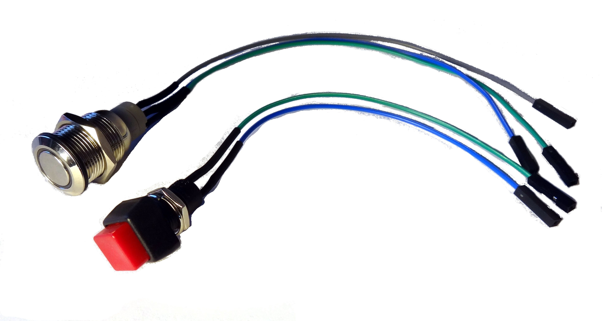
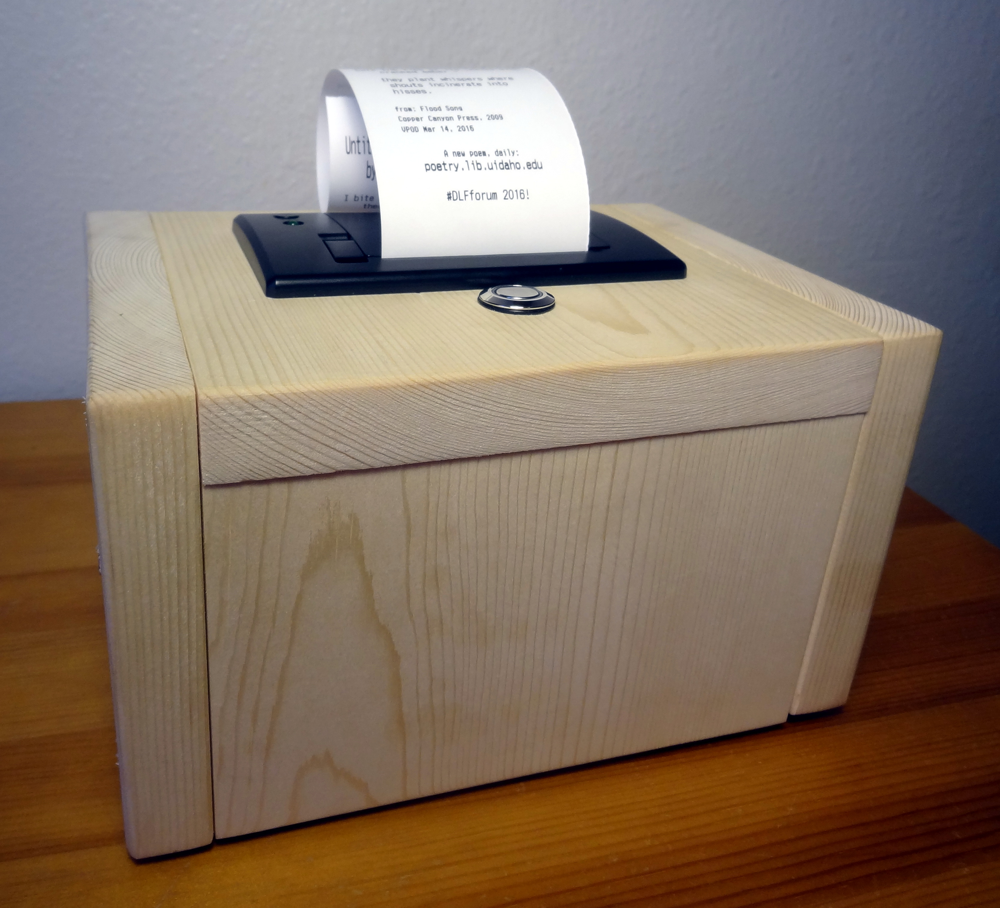
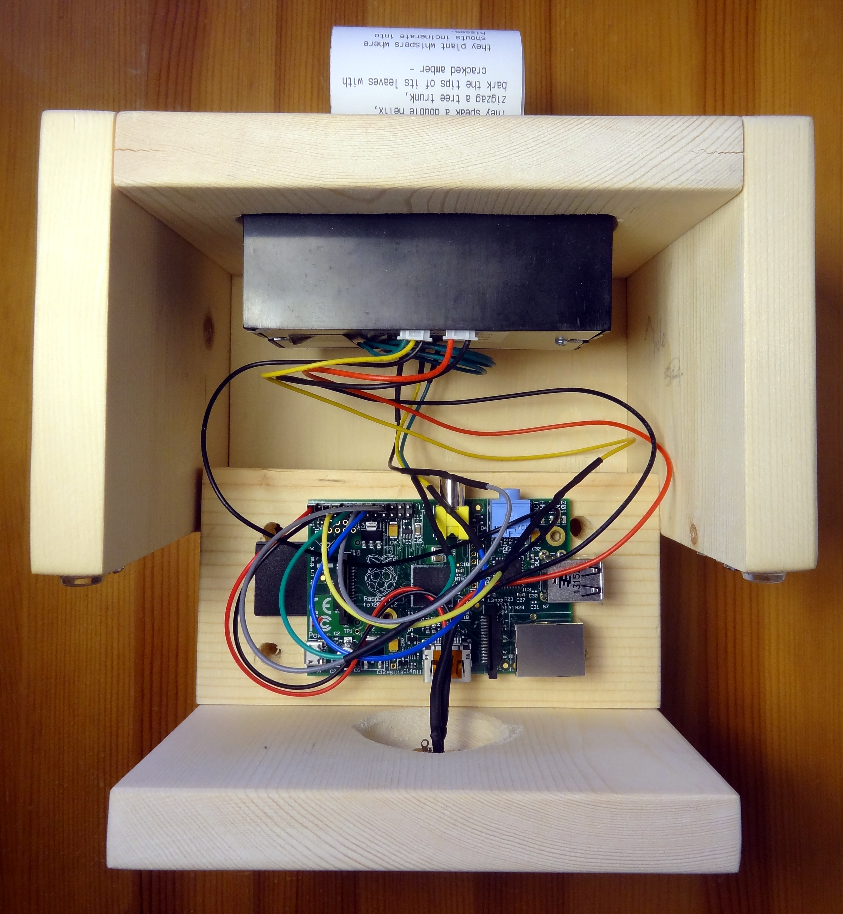

# poemBot

> printer + pi + python + poems. 

Easy to read, carry in your pocket, and share with your friends: poems printed on receipts are fun!

PoemBot is a [Raspberry Pi](https://www.raspberrypi.org/) connected to a [thermal receipt printer](https://www.adafruit.com/products/597) offering physical prints from a daily poetry website at the touch of a button. It was developed to help promote the [Vandal Poem of the Day](http://poetry.lib.uidaho.edu/) project which seeks to bring relevant contemporary poetry to University of Idaho and the broader Idaho community.
In addition to printing poems, poemBot does other fun stuff. It goes to conferences, attends poetry readings, creates contact cards for the library, and prints stuff for special events! 

Here is a little video of the earliest prototype: https://twitter.com/VandalPoem/status/704377485593432065 

And here are slides from a presentation at DLF Forum 2016: https://osf.io/wub5g/

Originally based on [Adafruit IoT Printer](https://learn.adafruit.com/pi-thermal-printer/overview), poemBot uses a version of the printer library from Adafruit [Python-Thermal-Printer](https://github.com/adafruit/Python-Thermal-Printer/blob/master/Adafruit_Thermal.py).

A full example implementation is available as `poemsMain.py` using public domain poems. 

## Case and Wiring

Our physical set up mostly follows [Adafruit IoT Printer](https://learn.adafruit.com/pi-thermal-printer/overview). 
However, to simplify construction and reuse, I replaced the t-cobbler with jumpers soldered to the components, inspired by [simonmonk's Squid](https://github.com/simonmonk/squid). This makes it easy to assemble, modify, and demo. 



I built cases out of 1x6 boards to give the poemBot a solid home.



Simplify set up, the basic GPIO pin connections are marked on a leaf `poembot_leaf.png` or printable `poembot_leaf.pdf`, based on [simonmonk's Raspberry Leaf](http://www.doctormonk.com/2013/02/raspberry-pi-and-breadboard-raspberry.html) concept.
Here's what it looks like inside:



## Example Implementation

This repository contains a complete example implementation using public domain poems, plus all the original VPOD files used for various purposes (which might not include the data and image files due to copyright). 
The main loop is `poemsMain.py` which loads poems to print from `goldenTreasuryPoems.csv`.
I created the poem CSV following a similar method as with VPOD using [OpenRefine](https://github.com/OpenRefine/OpenRefine) to parse the [HTML text](http://www.gutenberg.org/ebooks/19221) from Project Gutenberg.
Since there is no markup other than `<pre>` tags, parsing was mostly achieved using regular expressions.
I selected approximately 100 poems less than 20 lines in length. 
The CSV has the columns: `number,title,author,poem,book`. Number is the number given in the Golden Treasury.  

> THE GOLDEN TREASURY
> Of the best Songs and Lyrical Pieces
> In the English Language
> Selected by Francis Turner Palgrave 
> 1861
> [Project Gutenberg EBook #19221](http://www.gutenberg.org/ebooks/19221)

## Prepare Poems

The VPOD printer script loads the poems from a CSV with the columns: `VPODdate, title, author, poem, book`.
VPODdate is the date the poem appeared as Vandal Poem of the Day. 
The poem column contains the full text of the poem with no markup, only `\n`. Line indentation is replaced by spaces.
The book column is the title of the book where the poem appears plus the year of publication.

To create this data I exported all VPOD poems from the Wordpress poetry website in XML, with embedded HTML markup. 
I used [OpenRefine](https://github.com/OpenRefine/OpenRefine) to parse the XML and transform the data. 
I cleaned up the HTML markup, replacing CSS indentation with spaces and adding `\n`. 

Since the thermal printer is small with 32 normal characters per line, larger poems could take several feet of paper to print. 
I decided to limit the pool of poems based on number of lines and total characters. 
This can be done quickly with OpenRefine by creating new columns based on poem with ```value.split("\n").length()``` and ```length(value)```, then adding numeric facets. 
Export the subset of poems data as CSV from OpenRefine. 

Edit the CSV with a text editor (not LibreOffice or Excel) to remove the header and check the character encoding to avoid issues with Python and the printer. 
The Adafruit thermal printer only supports the [CP 437](https://en.wikipedia.org/wiki/Code_page_437) character set.
The current UTF-8 encoding can generate strange outputs on special characters. 
Convert the encoding to CP437.

## Set Up

The Raspberry Pi needs to be set up to run headless. 
SSH in for set up and testing. 
After testing the Python main loop and poem printing, set it to load on boot by editing rc.local:

```sudo nano /etc/rc.local```

Add the terminal command to start the python script before the line "exit 0":

```
cd /home/pi/poemBot
python poemsMain.py &
```

## References

UBC RAD-device, https://github.com/asistubc/RAD-device

Little Box of Poems, http://www.suppertime.co.uk/blogmywiki/2012/12/pi-poems/

Adafruit IoT Printer, https://learn.adafruit.com/pi-thermal-printer/overview

